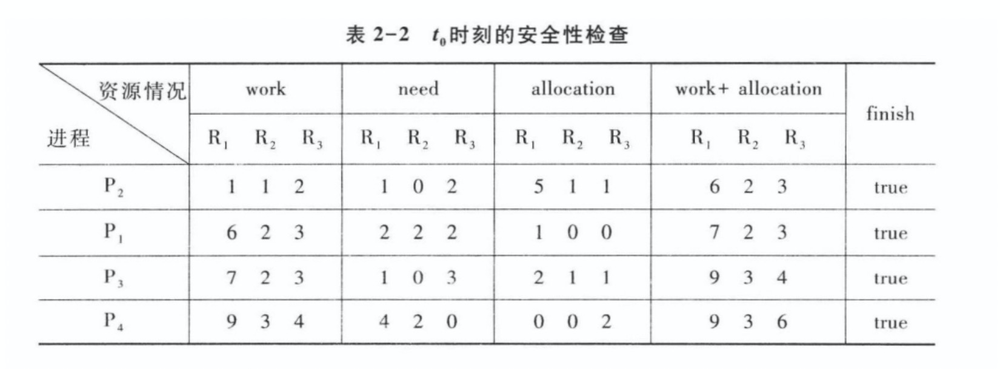
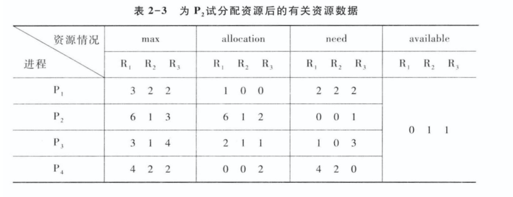
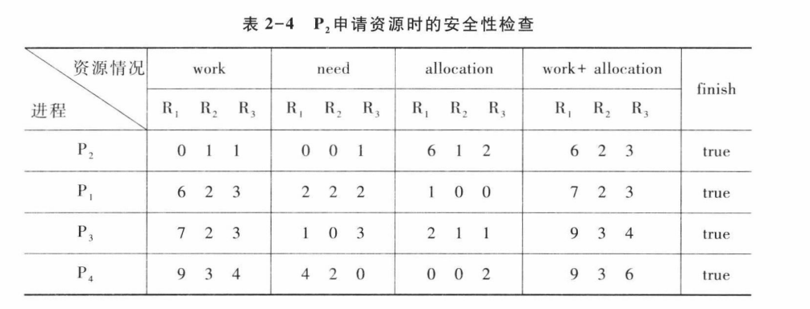
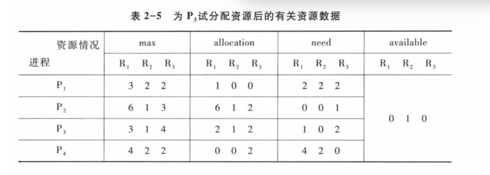

# 死锁

产生死锁的原因可以归结为亮点：  
1.竞争资源，当系统中供多个进程共享的资源，其数目不足以满足诸经常的需要时候，会引起诸进程对资源的竞争二产生死锁  
2.进程间推进顺序非法。进程在运行过程中，请求和释放资源的顺序不当，也同样会产生进程死锁

# 利用银行家算法避免死锁

是由于该算法能用于银行系统陷阱贷款的发放而得名。银行家算法的`实质`就是要设法保证系统动态分配资源后不进入不安全状态，以避免可能产生的死锁。

>何为不安全状态  
就是满足某个进程的需要以后，不能满足任何其他的进程的需要，故系统进入不安全的状态，此时系统不分配资源

# 安全性算法

这里看一下图，其中max表示系统中的进程对R类资源的最大数量，allocation表示进程已经分的R类资源的数量，need是进程尚需各类资源的数量，available表示系统中现有R类资源的数量

假定操作系统中的4个进程P1、P2、P3、P4和3类资源R1、R2、R3(资源数量分别为9、3、6)，在t0时刻的资源分配情况

T0时刻是否安全？  
P2发出请求向量request2(1,0,1),系统能否嫁给你资源非配给它？  
在P2申请资源后，若P1发出请求向量request1(1,0,1),系统是否将资源非配给它？

安全算法认为，在T0时刻存在完全序列，表示系统是安全的，否者就是非安全的

## 寻找安全序列

假设在T0时刻存在一个安全序列，那么我们任务系统是安全的，那么如何找到安全序列呢？

这里work是工作向量，表示系统可提供给进程继续运行所需的各类资源数目，它含有m个元素，在执行安全算法时候，Work=Available  
Finish表示系统是否 有足够的资源非配给进程，使之运行完成。开始时候，Finish[i]=false,当有足够资源分配给进程时候，再令Finish[i]=true

### 步骤

1 从进程中找到一个满足下述条件的进程  

* Finish[i]=false
* Need[i,j]<=Work[j]  

若找到执行步骤2，否者之行步骤 3

2 当进程获得资源后，可顺利执行，直至完成，并释放出分配给它的资源，故应之行

Work[j] = Work[j]+Allocation[i,j]
Finish[i]=true

继续第一个步骤1

3 如果所有的进程Finish[i]=true满足，则表示系统处于安全状态，否者系统处于不安全状态

### 示例

假设当前资源的分配情况如下图

利用安全安全性算法检查此时系统是否安全

  

由所进行的安全性检查得知，如上图所示，可以找到一个安全序列{P2,P1,P3,P4},故而系统是安全的，可以将P2所申请的资源分配给它

系统假定为P3分配资源，并修改available、allocation3和need3向量，由此形成的下图

Available(0,1,0)已不满足任何进程的需要，故系统进入不安全状态，此时系统部分配资源给P3

参考  
[操作系统——银行家算法（Banker's Algorithm）](https://www.cnblogs.com/wkfvawl/p/11929508.html)  
[死锁 & 银行家算法](https://www.jianshu.com/p/355f138ea3c8)  
《操作系统书籍》汤子瀛编 