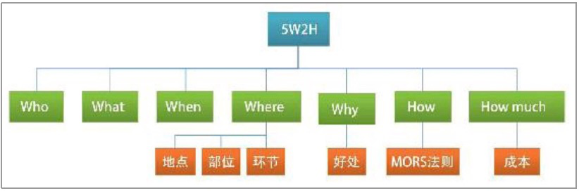

# 5W2H思维

5W2H分别是： 

谁（Who）：识别并确认主角； 

内容（What）：用定性、定量的语言描述并确定具体事物或问题；

何时（When）：说明事情首次发生或者经常发生的时间点或时间 段；

何地（Where）：事情发生地点、产品部位、工作流程的环节等； 

为什么（Why）：查明发生的原因； 

如何做（How）：如何处理、行动步骤； 多少（How much）：数量、金额、时间。

5W2H的思维模型如下

明确谁来做和关键人物是谁，以及明确做什么，是确保结果的第一 步，这就是Who和What的重要意义。

Why 主要是目标或者目的 How 即是针对这样的目标如怎样去完成 

如何做有三个关键点

1. 谁来行动，要因人制宜
2. 行动能实施，不是空中楼阁
3. 行动不走具体、翔实，让执行的人看完步骤后就能知道如何行动

在行为科学中有一条MORS法则，也称具体性原则，它对行为作了 明确的定义： 

M：Measured，即可测评，可以衡量和计算出做了多少； 

O：Observable，即可观察，无论是谁看到或者听见，都知道这事 怎么做；

R：Reliable，即可信赖，让多个人来看，他们都会认为是在做同一
件事；

S：Specific，即明确化，谁来做、做什么、怎么做，都很明确。

# 认知圈思维

是什么（What）、为什么（Why）、如何做（How）是人类认知事 物的过程。所谓认知事物，就是从未知到已知，再到建立对这个事物的 看法的全过程，因此称其为认知圈思维。

一 what

1. 是什么

	除了自己要清晰地知道“是什么”，在向其他人阐述表达时，也要能 解释清楚“是什么”，除非这个“是什么”大家都已经心知肚明。 解释“是什么”的时候，要用一到两句通俗易懂的语言简单概括， 不建议用长句，或者用很多复杂的概念解释，这会影响人们对于新事 物的认知。

2. 适用边界

	查理·芒格有一句话是：“手上拿着锤子的人，看什么都像钉 子。”这句话就没有边界，如果手上拿着锤子，并且给这个锤子画下一
个“只能锤左面墙上的钉子”的适用边界，我们就不会拿锤子锤右面墙上 的钉子，更加不会出现看什么都像钉子的情况。

	当我们接触到任何“是什么”时，一定要询问它的适用边界是什么， 也许告诉你“它是什么”的人并不知道什么是适用边界，那么你就要问： 是在什么场景下、环境下、条件下，使用这个“是什么”。当我们自己总 结经验时，也一定要加上适用边界，只有这样，我们才能总结出一件事 情在不同的发展阶段，所适用且正确的方式方法。当我们能把一件事 情所有的发展阶段都总结出其适用的方式方法时，我们就能形成体 系，成为领域专家。

3. 如何给“是什么”加上使用边界

	我们可以从以下几个方面来描述（可 以列举其中一种，也可以多种组合使用）：

	1. 时间（适用或者不适用的时间、时间段）：旺季、淡季，冬天、 夏天，三个月、半年。
	2. 空间（适用或者不适用的地点、部位、环节）：办公室、家、公 园，室内、户外，事物的某个部位，工作中的某个环节。 
	3. 对象（适用或者不适用的人、物品）：新客户、老客户，学生、 家长、老师，员工、主管、老板，初学者、有一定经验的人士。 
	4. 目标：解决××问题，达到××效果，实现××目标。

通过阐述以上内容，总结“是什么”（What）的公式如下： 

A是什么，适合谁在什么情况下使用，达到什么目标。 其中“是什么”是界定概念和划分范围，要通俗易懂，用两三句话 （短句、非专业术语、通俗概念、类比）说清楚适用边界，包含时间、 空间、对象、目标等。

 二 Why
 
 询问“为什么”的方式，常见的有以下3种：
 
 第一，为什么存在？即询问一个事物的由来。
 第二，为什么选择？换句话就是，你为什么做出这个选择？
 第三，为什么重要
 
 询问5次“为什么”，能帮助我们找到问题的本质。
 
 三 How
 
 第一，目标拆解法，就是把需要达成的目标进行拆解，常用在销售中  
 第二，对症下药法。问题之所以产生肯定是有原因的，我们就针对 其产生的原因，选择合适的解决方案。
 
 认识圈的例子：
 
  “领导，我打算让小张提前转正，他表现很优秀。”

 “领导，小张入职这段时间的表现非常优秀，连续完成了两个大 项目，他的工作态度和能力都是有目共睹的（是什么），我想我们应该 给予他奖励，一方面是激励他，另一方面也可以刺激那些老员工，让大 家知道，努力认真地工作就会得到赏识（为什么）。所以，我建议让小 张提前转正（如何做）。”
 
 四 **黄金思维**
 
 黄金圈思维模式是一种由内而外的思考方式。
 
 黄金圈思维从原理开始，先弄清楚“为什么”，搞定意义和价值观； 然后再回到战术层面，我们应该“怎么做”；最后才是了解我们做的“是 什么”。
 
 也即why-what-how的顺序
 
 因为先从Why思考，更容易发现事物的本质
 
 例如
 
 例如，我们在做项目介绍时： 

首先，告诉对方，我们为什么要做这件事。（因为消费者存在痛 点，找不到好的服务和产品。而目前的行业，又没有人去关注和解
决。）

然后，告诉对方，我们会怎么做、如何做才能帮助消费者，满足他 们的升级需求。 

最后，告诉对方，我们具体做了哪些事情，产生了怎样的效果。
 
 认知圈思维和黄金思维的结构化模型如下
 
 
 
 
 
# 流程思维

流程思维，顾名思义，就是在处理事情时，从事物发展的流程上进 行思考和把控。流程思维是按照时间顺序（也是步骤顺序），将一个事 件进行分解，可以将其简单地分为事前、事中、事后。对“前、中、 后”的把控，以及对“前”和“后”程度的拿捏，就是流程思维的艺术了。

流程思维最重要的是转变思路，从问题导向变成流程导向。

所以流程思维就是让我们从问题解决者转变成系统的设计者。

流程的六要素

一 构建活动流程

例如

你去服装店买衣服，导购员会根据客户不同的状态或者回答来执行的流程图

二 补充前沿和后沿

增加活动的前沿和后沿是从问题思维到流程思维的关键步骤，前期 完善的筹备工作和后期收尾的整合工作要相互配合才能说活动是完整的。

合起来就是PDCA的管理动作，PDCA的含义是将管理分为四个阶段，即计划（Plan）、执行 （Do）、检查（Check）、调整（Action）。第一阶段做出计划；第二 阶段实施计划；第三阶段在实施过程中要检查实施效果；第四阶段，根 据检查情况不断调整行动方案，之后进行复盘，总结优缺点，指导下一 次活动。

对应前文的内容，P是前沿，D、C是主活动，A是后沿。

三 构建多次活动管理

构建好主活动流程，并且补充了前沿和后沿以后，就需要把单次活 动，当成多次活动来思考。

流程管理的三个部分： 

第一，规划，定位于全局性、长远性、集合性。内容是计划、设 计、策略、预算、政策、标准等。 

第二，活动，活动完整的动作过程，内容包含前沿的计划和筹备、 主活动实施和运营、后沿的追踪和复盘，也就是事前、事中、事后，还 有P—DC—A完整的运作流程。 

第三，服务保障，提供资源、服务，内容包括人力资源管理、质 量、风险管理等。

# 人事物思维

如果工作想做得出彩，运用人事物思维会更胜一筹。

为什么人事物思维会更出彩？通过上述案例，我们可以看到流程思 维的重点在于事，人事物思维的重点在于人，要先明确参与人员，把 人安排清楚，满足人的需求，因为事和物是由人来行动和操作的，搞 定人，事和物自然水到渠成！

人事物思维是以人为出发点，人是处理事务的主角，是企业服务的
对象，也是创意和个性化的源泉。搞定了人，就搞定了一切。

琢磨人性，是我们毕生的功课。

# 故事思维

电影《后会无期》有句很经典的台词：“听过很多道理，依然过不 好这一生。”

道理很简单，但是不能够生动形象的说明问题，可以通过故事来使其印象更加深刻

例如 

《奇葩说》第六季冠军陈铭曾经靠一场演说而一战成名——《女人 永远是最佳辩手》

演讲稿看完了，我们回顾一下之前我提的三个问题：

1. 陈铭讲了个什么故事？ 

2. 故事的四个要素分别是什么？ 

3. 如果没有这个故事，演讲的效果如何？ 

参考答案： 

1. 女人与辩论的故事，更具体来说是一个由买包产生的辩论故事。 

2. 故事四要素分别是：
	 
	 ①背景：陈铭的妻子看中了一款美而贵的包。 
	 
	②冲突：经济实力不允许买这么贵的包。
	 
	③问题：如何说服她不买这么贵的包？
	 
	④回答：通过各个方面来说服她，上到民族情怀，中到职场关系， 下到性价比、收益比，然而失败了，只能刷卡埋单。 

3. 如果没有这个故事，演讲稿便枯燥、无味，论点没有支撑，无法说服我们。

# 客户思维

严格来说，客户思维并不是一种全面的思考方法，而是站在对方的 立场上换位思考。为什么笔者会把客户思维归属于结构化思维呢？因为 我们可以用结构化思维的方式，掌握和运用客户思维。

对象包括`需求` `特点` `忌讳` 

吸收包括`表达方式` `顺利解读` 要把问题讲明白

行动包括`明确目标` `激发行动` “你看多么容易，只要这样做，就能把这件事情做 成！”这样才能激发对方行动起来”

例如

1. 汇报工作时直接说结果。
2. 请示工作时说方案。
3. 总结工作时说关键点。
4. 规划工作时说标准  
等等

# 水平思维和垂直思维

水平思维与垂直思维是一种复合性思维，也就是两种思维结合使用。

一 水平思维

对水平思维最简单的描述是：“在不同的地方挖出不同的洞。”

二 垂直思维

比如，桌上有一副眼镜。 水平思维可以由眼镜想到各方面的事物，不同的品牌、代言人、眼 保健操、护眼灯、护眼壁纸、墨镜……

三 综合运用

先从水平思维着手，再进行垂直分析。

# T字思维

т字思维是一种复合性思维，单一的思维并不能解决复杂的情况， 这时候往往需要合适的复合性思维分析和处理问题。

你可能会说：“这不就是在水平与垂直思维上再加一个垂直思维 吗？还要再命名另外一个思维名字，搞得好复杂！”

因此我们要用动态的眼光看待T字思维。在一个流程中，我们可以 亲力亲为地负责其中一个环节，其他的环节是由别人负责。这时，我们 要对自己负责的环节进行垂直分析，对于其他人的环节则进行单点接 触。如果属于领导关系，就需要在时间进度和成果上进行把控。如果是 同事关系，则需要保持沟通。

看到这里我相信大家已经明白什么是T字思维了，就是用流程管理 来把控横向节奏，用垂直思维深入透彻分析每一个关键事项，以达到
从全局的角度掌控复杂工作，推动工作发展的目的。

参考  
《结构化思维》黎甜