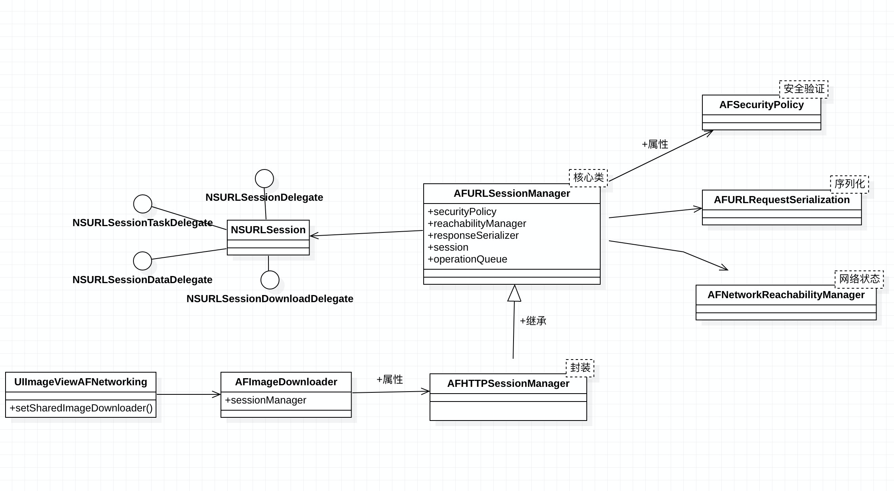

# 架构

AFNetworking 一共分为三个模块，核心模块、辅助模块和应用模块

Core

* AFURLSessionManager()(核心下载类)
   * NSURLSession (苹果的下载类)
	* NSOperationQueue（多线程资源调度）
   
* AFHTTPSessionManager(继承AFURLSessionManager,对其封装)

Additional Functionality

* AFNetworkReachabilityManager(网络监听)
* AFSecurityPolicy(安全验证)
* AFURLRequestSerialization(序列化)

application

* AFImageDownloader(图片下载)
* UIImageView+AFNetworking(图片下载的应用)



# AFURLSessionManager
   * 线程
	
	```
	self.operationQueue = [[NSOperationQueue alloc] init];
   self.operationQueue.maxConcurrentOperationCount = 1;
	```
	
	有设置`NSOperationQueue`的`maxConcurrentOperationCount`的数值是1然后又使用如下代码赋值只`session`
	
	```
	_session = [NSURLSession sessionWithConfiguration:self.sessionConfiguration delegate:self delegateQueue:self.operationQueue];

	```
	
	NSURLSession 代理方法回调是异步的，所以收到回调时的线程模式是“异步+串行队列”，这个时候可以理解为处于回调线程。
	
	任务结束以后，异步切换到 processing queue 进行数据解析，数据解析完成后再异步回到主队列或者自定义队列。
	
	```
dispatch_async(url_session_manager_processing_queue(), ^{
    NSError *serializationError = nil;
    responseObject = [manager.responseSerializer responseObjectForResponse:task.response data:data error:&serializationError];
	
	 ...

    dispatch_group_async(manager.completionGroup ?: url_session_manager_completion_group(), manager.completionQueue ?: dispatch_get_main_queue(), ^{
        if (self.completionHandler) {
            self.completionHandler(task.response, responseObject, serializationError);
        }

        dispatch_async(dispatch_get_main_queue(), ^{
            [[NSNotificationCenter defaultCenter] postNotificationName:AFNetworkingTaskDidCompleteNotification object:task userInfo:userInfo];
        });
    });
});
	```
	
   * AFURLSessionManagerTaskDelegate

   AFURLSessionManager 中几乎实现了所有的 NSURLSession 相关的协议方法：
   
      * NSURLSessionDelegate
      * NSURLSessionTaskDelegate
      * NSURLSessionDataDelegate 
      * NSURLSessionDownloadDelegate

   `AFURLSessionManager`通过如下代码，将`task`和`AFURLSessionManagerTaskDelegate`存储在`mutableTaskDelegatesKeyedByTaskIdentifier `中并一一对应起来
   
   ```
   - (void)setDelegate:(AFURLSessionManagerTaskDelegate *)delegate
            forTask:(NSURLSessionTask *)task
{
    NSParameterAssert(task);
    NSParameterAssert(delegate);

    [self.lock lock];
    self.mutableTaskDelegatesKeyedByTaskIdentifier[@(task.taskIdentifier)] = delegate;
    [self addNotificationObserverForTask:task];
    [self.lock unlock];
}

   ```
	
在回调结束的时候，通过如下代码，找到task对应AFURLSessionManagerTaskDelegate并去执行相应的逻辑，保证多线程执行数据的安全性

```
- (void)URLSession:(NSURLSession *)session
      downloadTask:(NSURLSessionDownloadTask *)downloadTask
 didResumeAtOffset:(int64_t)fileOffset
expectedTotalBytes:(int64_t)expectedTotalBytes
{
    
    AFURLSessionManagerTaskDelegate *delegate = [self delegateForTask:downloadTask];
    
    if (delegate) {
        [delegate URLSession:session downloadTask:downloadTask didResumeAtOffset:fileOffset expectedTotalBytes:expectedTotalBytes];
    }

	...
}
```	

# 小Tips

方法来创建对象，来避免使用单例

```
+ (instancetype)serializer {
    return [[self alloc] init];
}
```

使用`NSLock`来保证线程的安全性

```
[self.lock lock];
self.mutableTaskDelegatesKeyedByTaskIdentifier[@(task.taskIdentifier)] = delegate;
[self.lock unlock];

```

多线程中线程组的使用，使用不同的队列之间的切换来处理不同的任务

```
dispatch_group_async(manager.completionGroup ?: url_session_manager_completion_group(), manager.completionQueue ?: dispatch_get_main_queue(), ^{
	...
});
```

面向协议编程

```
@property (nonatomic, strong) id <AFURLResponseSerialization> responseSerializer;

```

线程处理，先进先出和后进先出等
  
   * AFImageDownloadPrioritizationFIFO
   * AFImageDownloadPrioritizationLIFO

```
- (void)enqueueMergedTask:(AFImageDownloaderMergedTask *)mergedTask {
    switch (self.downloadPrioritization) {
        case AFImageDownloadPrioritizationFIFO:
            [self.queuedMergedTasks addObject:mergedTask];
            break;
        case AFImageDownloadPrioritizationLIFO:
            [self.queuedMergedTasks insertObject:mergedTask atIndex:0];
            break;
    }
}
```

自动清除缓存

```
dispatch_barrier_async(self.synchronizationQueue, ^{
		 ...
        for (AFCachedImage *cachedImage in sortedImages) {
            [self.cachedImages removeObjectForKey:cachedImage.identifier];
			...
       }
       ...
    }
});

```

断言的使用, NSAssert会报告出错误信息并且打印出来

```
NSAssert([self respondsToSelector:@selector(state)], @"Does not respond to state");

```

黑魔法的使用，替换 NSURLSessionTask 的 -resume 和 -suspend 方法

```
static inline void af_swizzleSelector(Class theClass, SEL originalSelector, SEL swizzledSelector) {
    Method originalMethod = class_getInstanceMethod(theClass, originalSelector);
    Method swizzledMethod = class_getInstanceMethod(theClass, swizzledSelector);
    method_exchangeImplementations(originalMethod, swizzledMethod);
}
```

由于`NSURLSessionTask`是类簇，具体的类不能通过`+class `获取要注意

> 类簇即是子类写成私有的类，所有对外都在父类中调用即可，避免子类过多，不便使用

# 参考
[AFNetworking 源码分析](https://xiaozhuanlan.com/topic/7510469283)  
[AFNetworking(v3.1.0) 源码解析](https://juejin.im/entry/5bf626b2f265da614e2bb7dd)  
[iOS开发中的类簇设计模式](https://blog.devzeng.com/blog/ios-class-cluster-design-pattern.html)


