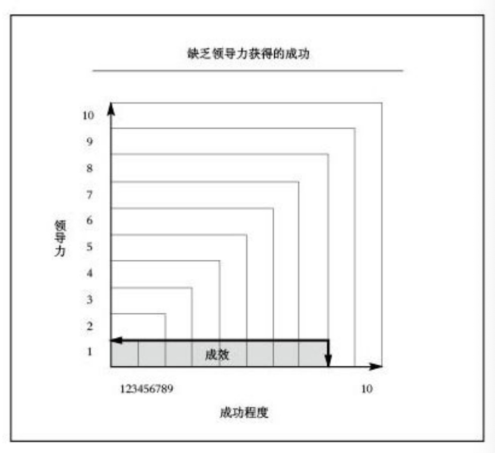

### 1 盖子法则
领导力决定一个人的办事效力

**盖子法则**：锅里的水总是漫不过盖子，领导力就像一个盖子，它决定了一个人的办事效力

#### 缺乏领导力获得成功

#### 将  **盖子法则**  运用于你的生活

1. 列出一些你希望达成的主要目标,哪些目标需要其他人参与或者合作 
2. 对你的领导力水平做一个自我评估 
3. 让别人给你的领导力水平打分
	- 人际交往能力
	- 规划能力和战略思维
	- 远见卓识
	- 业绩

### 2 影响力法则
衡量领导力的真正尺度是影响力

领导力的本质恰恰就是影响力

#### 领导力不是...

真正的领导地位是无法被授予、指派或委任的。因为真正的领导力来自一个人的影响力，而影响力是无法被委任的，必须靠自自己去赢得。

#### 有关领导力的五大误解

1. 管理者就是领导者

	两者之间的主要区别在于：领导指的是影响他人，让他人追随自己，而管理关注的焦点是维持既定的系统和流程。

2. 企业家就是领导者

	如果他们无法影响别人，也就无法领导别人。

3. 知识渊博的人就是领导者

	无论是智商还是受教育程度都不能跟领导力画等号。
	
4. 引领潮流的人就是领导者

	要成为领导者，一个人不仅要走在前面，还要有人愿意跟着他走，愿意服从他的领导，并且愿意采取行动去实现他描绘的愿景。
	
5. 位高权重的人就是领导者

	不是职位造就了领导者，而是领导者造就了职位。
	
#### 谁才是真正的领导者？

领导力只有在追随者那里才能得到证明

#### 领导力是...

**性格——他们是谁**

人们能够真切地感受到他性格中深层次的东西

**关系——他们认识谁**

要想成为一个领导者，就必须得有人追随你才行，这往往需要你去发展一些人际关系——这种关系越密切，你的领导潜力了就越大。

**知识——他们知道什么**

信息对于领导者来说至关重要。你需要掌握事实，了解动态变化的因素和把握好采取行动的时机，同时还要对未来的发展有 **远见卓识**

**直觉——他们感受到了什么**

领导者会试图去识别和影响一些无形的因素，比如精力、士气、时机以及动力。

**经验——他们去过哪里**

作为一名领导者，你在过去面临过的挑战越大，你目前的追随者愿意给你机会的可能性也就越大。

**过去的成就——他们做过什么**

对于追随者来说，没有什么比良好的过往成绩更有说服力。

我取得的每一次成功都会让我的追随者们更加相信我的领导能力，并因此更愿意听从我的指挥。

**能力——他们能做什么**

他们想要知道那个人能否带领图啊对走向成功的彼岸。

#### 不借助其他优势的领导力

所有影响力的本质都在于让别人参与其中——心理学家哈利·奥威斯特

那些自以为是领导，但却没有追随者的人，只不过是在说大话罢了。

衡量领导力的真正尺度只能是影响力，不可能是其他的任何因素。

#### 将  **影响力法则**  运用于你的生活

1. 五大误解中，你曾经有过哪几个？

2. 就本章涉及的七大因素，按照从1到10的衡量尺度给自己打分
	- 性格——你是谁
	- 关系——你认识谁
	- 知识——你知道什么
	- 直觉——你感受到了什么
	- 经验——你去过哪里
	- 过去的成就——你做过什么
	- 能力——你能做什么

3. 找一个组织，去里面当志愿者。

以下更新中。。。

### 3 过程法则
领导力的提升是日积月累的结果，而非一日之功

### 4 导航法则
谁都可以掌舵，唯有领导者才能设定航线

### 5 增值法则
领导者为他人提升价值

### 6 根基法则
信任是领导者的根基所在

### 7 尊重法则
人们通常愿意追随比自己强的领导者

### 8 直觉法则
领导者善用领导直觉评估每件事情

### 9 吸引力法则
你只能吸引和那你相似的人

###10 亲和力法则
领导者深知，得人之前必先得其心

### 11 核心圈法则
一个领导者的潜力，由最接近他的人决定

### 12 授权法则
有安全感的领导者才会授权予人

### 13 镜像法则
看到别人怎么做，大阿甲也会怎么做

### 14 接纳法则
人们先接纳领导者，然后接纳他描绘的愿景

### 15 制胜法则
领导者为他的团队找出一条致胜之路

### 16 动势法则
动势是领导者最好的朋友

### 17 优先次序法则
领导者明白，忙碌不一定等于成效

### 18 舍的法则
领导者必须先“舍”后“得”

### 19 时机法则
掌握时机与善用策略通用重要

### 20 爆炸性倍增法则
培养追随者，得到相加的效果；培养领导者，得到倍增的效果

### 21 传承法则
一个领导者的长久价值由其继承者决定

结语 兴衰成败皆系于领导力

备注

[git地址](https://github.com/zhuhao528/book.git)

